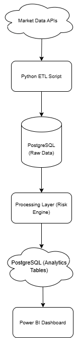
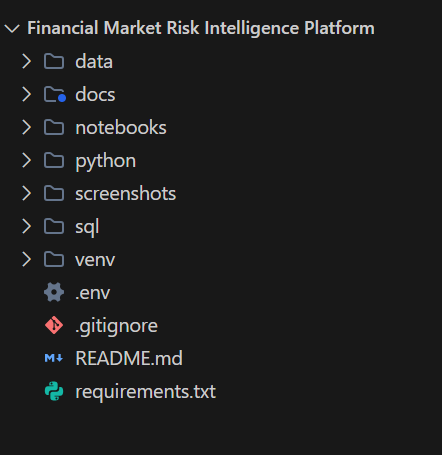

# Financial Market Risk Intelligence Platform


An end-to-end financial analytics project built with **Python, PostgreSQL, and Power BI** to analyze portfolio risk, asset performance, and market conditions across **equities, crypto, commodities, and benchmark indices**.

This project simulates how portfolio managers and risk analysts monitor:
- Portfolio performance and cumulative returns
- Rolling volatility and risk regimes
- Value at Risk (VaR) at 95% confidence
- Risk-adjusted performance (Sharpe ratio)
- Drawdowns and maximum drawdown tracking
- Cross-asset correlations
- Portfolio construction and risk-return trade-offs

---

## Project Overview

The platform ingests historical market data from Yahoo Finance, stores it in a cloud PostgreSQL warehouse, transforms and analyzes it through a Python analytics engine, and delivers interactive dashboards through Power BI.

### Key Capabilities
- Multi-asset market data extraction pipeline (3 years of daily data)
- SQL-based data warehouse with star schema (fact + dimension tables)
- Python-based financial analytics engine (7 metric categories)
- Semantic SQL views for clean BI consumption
- 4-page Power BI dashboard for portfolio monitoring and market analysis

---

## Tech Stack

| Layer | Technology | Purpose |
|---|---|---|
| **Data Extraction** | Python, yfinance | Automated market data ingestion |
| **Data Storage** | PostgreSQL (Neon) | Cloud-hosted data warehouse |
| **Analytics Engine** | Python, pandas, NumPy | Financial calculations and risk metrics |
| **Visualization** | Power BI | Interactive dashboards and KPIs |
| **Database Admin** | pgAdmin | Schema management and queries |
| **Development** | VS Code | IDE and development environment |

---

## Architecture



```
Market Data APIs (Yahoo Finance)
        ↓
Python ETL Layer
        ↓
PostgreSQL Raw Layer
  • dim_assets
  • fact_market_prices
        ↓
Python Analytics Engine
  • daily & cumulative returns
  • rolling volatility (7d, 30d)
  • Value at Risk (95%)
  • Sharpe ratio
  • drawdown & max drawdown
  • rolling correlations
  • portfolio metrics
        ↓
PostgreSQL Reporting Layer
  • fact_risk_metrics
  • fact_portfolio_metrics
  • fact_rolling_correlations
        ↓
SQL Views / Semantic Layer
  • v_asset_risk_metrics
  • v_portfolio_risk_metrics
  • v_asset_correlations
  • v_latest_asset_risk_metrics
        ↓
Power BI Dashboard (4 pages)
```

---

## Data Model


### Raw / Warehouse Layer

| Table | Description |
|---|---|
| `dim_assets` | Dimension table with asset metadata (ticker, name, class, exchange, currency) |
| `fact_market_prices` | Daily OHLCV price data with foreign key to dim_assets |

### Reporting / Analytics Layer

| Table | Description |
|---|---|
| `fact_risk_metrics` | Per-asset daily risk metrics (return, volatility, VaR, Sharpe, drawdown) |
| `fact_portfolio_metrics` | Portfolio-level daily risk metrics |
| `fact_rolling_correlations` | 30-day rolling correlations between all asset pairs |

### Semantic / BI Layer (Views)

| View | Description |
|---|---|
| `v_asset_risk_metrics` | Enriched asset risk view joined with dim_assets |
| `v_portfolio_risk_metrics` | Clean portfolio metrics for BI |
| `v_asset_correlations` | Correlation data for matrix visualization |
| `v_latest_asset_risk_metrics` | Most recent risk snapshot per asset |

---

## Financial Metrics Implemented

### Asset-Level Metrics

| Metric | Window | Description |
|---|---|---|
| Daily Return | 1 day | Percentage change in close price |
| Cumulative Return | Full period | Compounded total return since start |
| Volatility (7D) | 7-day rolling | Short-term return standard deviation |
| Volatility (30D) | 30-day rolling | Medium-term return standard deviation |
| Value at Risk (95%) | 30-day rolling | 5th percentile of return distribution |
| Sharpe Ratio | 30-day rolling | Risk-adjusted return (mean / std) |
| Drawdown | Running | Peak-to-trough decline from running maximum |
| Maximum Drawdown | Running | Worst drawdown observed to date |
| Rolling Correlation | 30-day rolling | Pairwise correlation between all assets |

### Portfolio-Level Metrics

| Metric | Description |
|---|---|
| Portfolio Return | Weighted sum of asset daily returns |
| Portfolio Cumulative Return | Compounded portfolio return |
| Portfolio Volatility (30D) | Rolling standard deviation of portfolio returns |
| Portfolio VaR (95%) | 5th percentile of portfolio return distribution |

---

## Dashboard Pages

### 1. Executive Overview


High-level portfolio monitoring page with:
- Portfolio Return, Volatility, VaR, and Sharpe KPI cards
- Cumulative Asset Returns time series (indexed to 100)
- 30-Day Volatility by Asset bar chart
- Risk-Adjusted Performance (Sharpe Ratio) ranking

### 2. Risk Analytics


Portfolio and asset risk monitoring page with:
- Portfolio Value at Risk (95%) trend line
- Asset Volatility Trend (multi-line)
- Asset Correlation Matrix (heatmap)
- Asset Drawdown Analysis (multi-line)

### 3. Portfolio Construction


Portfolio design and diversification analysis with:
- Portfolio Allocation donut chart
- Portfolio vs Market Benchmark (S&P 500) comparison
- Risk Contribution by Asset (weighted bar chart)
- Risk vs Return scatter (Efficient Frontier approximation)

### 4. Market Analysis


Market regime, asset leadership, and diversification page with:
- Relative Asset Performance (cumulative return comparison)
- Rolling Correlation Trend
- Volatility Regime (30-day rolling by asset)
- Latest Market Snapshot table (returns, volatility, VaR, Sharpe, max drawdown)
- Top / Bottom Performers bar chart

---

## Assets Analyzed

The project covers a diversified multi-asset universe:

| Ticker | Asset | Class |
|---|---|---|
| `^GSPC` | S&P 500 Index | Benchmark Index |
| `AAPL` | Apple Inc. | Equity |
| `TSLA` | Tesla Inc. | Equity |
| `BTC-USD` | Bitcoin | Cryptocurrency |
| `ETH-USD` | Ethereum | Cryptocurrency |
| `GLD` | SPDR Gold Shares | Commodity ETF |

---

## Project Structure



```
Financial Market Risk Intelligence Platform/
│
├── dashboard/                  # Power BI dashboard files
├── data/
│   ├── raw/                    # Extracted raw market data (CSV)
│   └── processed/              # Transformed analytics-ready data (CSV)
├── docs/
│   └── data_dictionary.md      # Full table and column documentation
├── notebooks/
│   └── exploratory_analysis.ipynb
├── python/
│   ├── analytics/              # Financial analytics scripts
│   │   ├── calculate_returns.py
│   │   ├── calculate_volatility.py
│   │   ├── calculate_var.py
│   │   ├── calculate_portfolio_metrics.py
│   │   └── calculate_advanced_metrics.py
│   ├── database/               # DB connection and loading scripts
│   │   ├── db_connection.py
│   │   ├── load_to_postgres.py
│   │   ├── load_reporting_tables.py
│   │   └── test_connection.py
│   ├── extraction/             # Data extraction scripts
│   │   └── extract_market_data.py
│   └── transformation/        # Cleaning and transformation scripts
│       └── clean_market_data.py
├── screenshots/                # Dashboard and architecture screenshots
├── sql/                        # Schema, tables, views, inserts
│   ├── create_schema.sql
│   ├── create_tables.sql
│   ├── create_reporting_tables.sql
│   ├── create_views.sql
│   └── insert_dim_assets.sql
├── run_pipeline.py             # Single-command pipeline orchestrator
├── README.md
├── requirements.txt
├── .env.example                # Environment variable template
├── .gitignore
└── LICENSE
```

---

## How to Run

### 1. Clone the Repository

```bash
git clone https://github.com/your-username/financial-market-risk-intelligence-platform.git
cd "Financial Market Risk Intelligence Platform"
```

### 2. Create and Activate Virtual Environment

```bash
python -m venv venv
venv\Scripts\activate        # Windows
# source venv/bin/activate   # macOS/Linux
```

### 3. Install Dependencies

```bash
pip install -r requirements.txt
```

### 4. Configure Environment Variables

Copy the example file and fill in your database credentials:

```bash
copy .env.example .env       # Windows
# cp .env.example .env       # macOS/Linux
```

Then edit `.env` with your PostgreSQL connection details.

### 5. Set Up the Database

Run the SQL scripts in order using pgAdmin or any PostgreSQL client:

1. `sql/create_schema.sql`
2. `sql/create_tables.sql`
3. `sql/insert_dim_assets.sql`
4. `sql/create_reporting_tables.sql`
5. `sql/create_views.sql`

### 6. Run the Full Pipeline

```bash
python run_pipeline.py
```

Or run each stage individually:

```bash
python python/extraction/extract_market_data.py
python python/database/load_to_postgres.py
python python/transformation/clean_market_data.py
python python/analytics/calculate_returns.py
python python/analytics/calculate_volatility.py
python python/analytics/calculate_var.py
python python/analytics/calculate_portfolio_metrics.py
python python/analytics/calculate_advanced_metrics.py
python python/database/load_reporting_tables.py
```

### 7. Open the Power BI Dashboard

Connect Power BI to the PostgreSQL semantic views and explore the 4 dashboard pages.

---

## Key Outcomes

- Built a **complete financial analytics pipeline** from API ingestion to BI reporting
- Processed **5,000+ daily market observations** across 6 diversified assets
- Implemented **9 professional risk metrics** used in institutional portfolio management
- Designed a **4-page Power BI dashboard** with KPI cards, time series, heatmaps, and scatter plots
- Applied a **layered data architecture**: raw warehouse → analytics engine → semantic views → BI

---

## Future Improvements

- Monte Carlo simulation for a smoother efficient frontier visualization
- ML-based volatility forecasting (GARCH, LSTM)
- Macroeconomic indicator integration and regime detection
- Cloud deployment with automated daily data refresh
- Stress testing and scenario analysis module

---

## Author

**Irfan Arif**
MSc FinTech & Trading | BSCS
Focused on financial analytics, data pipelines, and portfolio risk intelligence

---

*Built as a portfolio project demonstrating end-to-end financial data engineering and analytics capabilities.*
